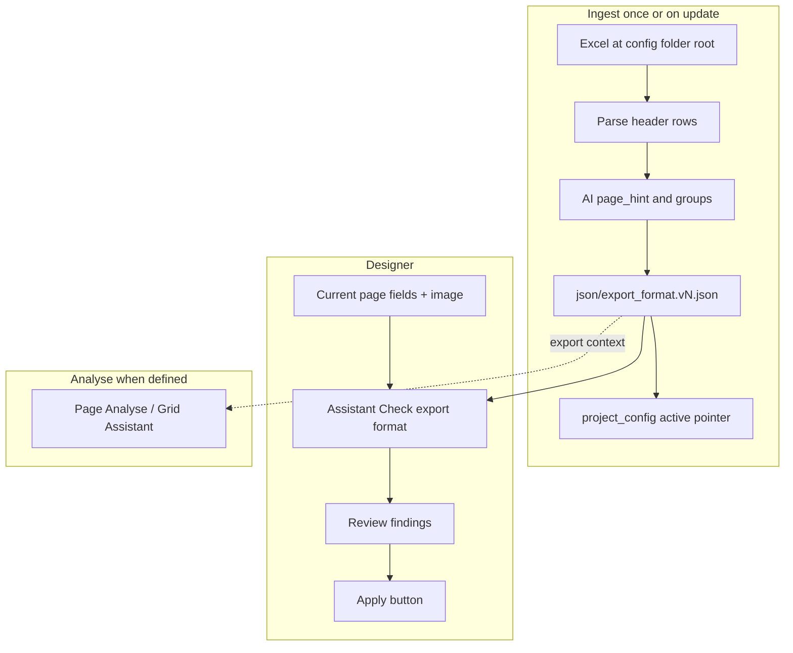

# Export Assistant for Designer — Plan

Status: **implemented** (see `AGENTS.md` for the durable contract).  
Package path: `runtime_assistants/design_assistant/export_assistant_for_designer/`.

## Context

Designing against a customer survey PDF can start before a sample export file exists. When a sample Excel export arrives mid-design (e.g. `EXAMPLES/ExportSampleROI.xlsx`), the customer expects the **final delivery to match that export’s column layout**. The sample is often not final: examination already showed at least one question missing from the export file, and other discrepancies are possible. A later “final” export may require a second alignment pass.

Today, page Analyse / Grid Assistant infer field names from the printed form. Export headings (Qualtrics-style long question text + answer option subheaders) are a separate contract. Design operators need AI help to re-evaluate `column_title`, answer values / option labels, and coverage against the export—without repeatedly feeding the raw Excel workbook into the VLM.

Reference sample (gitignored under `EXAMPLES/`): Qualtrics-like workbook with **row 1** = question stem (first column of a multi-option block), **row 2** = option / response type labels (`Response`, `Open-Ended Response`, or choice text), then sparsely populated data rows.

## Goal

At design time in Designer:

1. **Import** a customer export file (Excel) from the project **config folder root** (next to `template.pdf` / `template.tif`).
2. **Build** a versioned structured descriptor under `json/` (e.g. `export_format.v1.json`) describing export headings and related metadata; `project_config.json` points at the active version.
3. Use that JSON as the **canonical export contract** for AI (Check / Analyse)—not the Excel file.
4. When ready, run **Assistant → Check export format** to evaluate the **current page** (and report project-wide gaps) against the active descriptor; operator **reviews**, then **Apply** on command.

Re-import of a revised Excel creates a **new version** of the descriptor and allows a second Check pass.

## Decisions (locked)

| Topic | Decision |
|-------|----------|
| Excel location | Config folder **root** (not under `json/`); file dialog defaults there |
| Descriptor location | Versioned under `json/` — `export_format.vN.json`; active version pointer in `project_config.json` |
| Descriptor over Excel for AI | Always: prompts and Check use JSON only; Excel is ingest input only |
| Import UI | **File** menu (“Import export format…”) |
| Check UI | **Assistant → Check export format**; preview then **Apply** button (no silent writes) |
| Page hints | **AI** adds `page_hint` during ingest enrich (not manual-only) |
| Match key | **Id after Apply:** store `export_column_id` on fields; re-Check verifies header text; warn if linked column changed in new `vN` |
| Analyse integration | When active descriptor exists, inject page-relevant columns into **Analyse** and **Grid Assistant** prompts; if none defined, behaviour unchanged |
| Meta / system columns | Kept in descriptor as `meta_columns`; **ignored by Check**; must appear in **final Exporter delivery** (follow-up) |
| Tickbox cell values | Design-time stay **`"Ticked"`**; Qualtrics-style `1`/blank is an **Exporter transform**, not Designer metadata |
| On form, missing from export | **Warning**, not error (expected for non-final samples) |
| Radio / missed-question naming | Sparse sample rows: radio option labels use **full printed text verbatim**; questions present on the form but missing from the export also default **`column_title` / names to full text verbatim** |
| Side effects | Check is side-effect free until Apply |
| Re-run | New Excel → new `export_format.vN.json` + update pointer; retain prior versions |

### Naming defaults (locked)

- **Radio buttons / radio options:** use the **full answer text verbatim** (not shortened), because sample data rows are too sparse to infer recodes or short labels reliably.
- **Entire questions missing from the export file:** when Check (or Apply proposals) must invent a delivery heading for a form-only field, default to the question’s **full text verbatim** (`full_text` / printed stem)—do not invent Qualtrics-style abbreviations.

### Follow-up outside this Designer package

- **Meta columns** (Respondent ID, Collector ID, timestamps, etc.): ignored while checking design fields, but **inserted on final export**. Document and implement under Exporter / `OUTPUT_FORMATS/`.
- **Selected-value encoding** (`Ticked` → `1`, blank unchecked): Exporter delivery transform; leave Designer alone for now.

## Architecture

## Proposed descriptor shape

See `schema.py` and `AGENTS.md`.

## Implementation order

1. Phase 0 — ingest + versioned JSON + tests  
2. Phase 1 — Check + preview + Apply  
3. Phase 2 — Analyse/Grid export context + DOX / Exporter cross-links  

## Out of scope (explicit)

- Exporter delivery transforms (meta columns, `1`/blank encoding)
- Requiring Excel before any design work
- Auto-deleting form fields absent from a non-final export
- Overwriting prior `export_format.vN.json` on re-import (always bump version)
