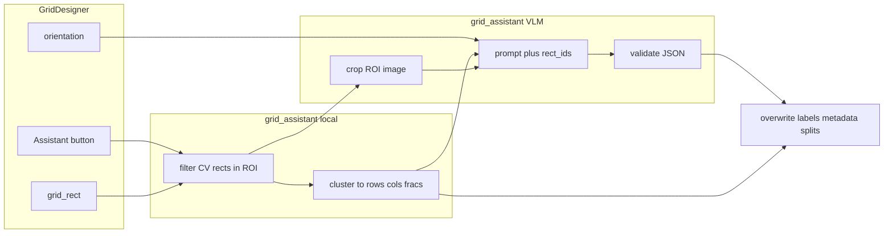

# Grid Assistant Plan

Status: **implemented** (see `AGENTS.md` for the durable contract).

## Goal

Add a Grid Designer **Assistant** button that, given a drawn grid ROI, user-selected orientation, and ≥2 OpenCV answer rectangles inside that ROI, fills grid metadata and row/column labels via local geometry plus a focused VLM crop.

## Decisions (locked)

- Reuse existing metadata fields: `full_text`, `summary`, `column_title`, `name`.
- Add **`question_number`** (optional string, e.g. `"1.7"`). Never put question numbers on answer / `RadioButton` labels (sample export does not use them there).
- **No 50-character limit** on grid name, row labels, or column labels (nor on persisted `name` / `column_title`). Overlay display stays capped via `summary` / `display_label` (50).
- Assistant **autofills and overwrites** Grid Designer fields on success.
- Prerequisites (hard): drawn grid rectangle + **≥2** OpenCV answer rects intersecting that ROI. Happy path assumes the user has already added/removed/reshaped rectangles on the main Designer.
- ROI text coverage: **advise only** (tooltip/status: include main question + answer/row labels in the drawn rect). Do **not** require OpenCV boxes around text—only answer checkboxes. No geometric text-in-ROI hard check.
- Orientation: trust the user toggle for layout interpretation; **warn** in the status bar if clustered box layout strongly disagrees.
- New package under `runtime_assistants/design_assistant/grid_assistant/`. Leave existing page Analyse files in place; rewrite/cleanup of page Analyse comes later.

### Naming examples (from samples)

| Role | Three-column | Single-column (vertical) |
|------|--------------|--------------------------|
| `question_number` | `1.7` | `1.2` |
| `summary` / `name` (overlay) | `Health and Safety` | short summary (flexible) |
| `full_text` | full stem (“From a health… farm?”) | full stem (= column full text) |
| Column labels | Good, Average, Poor | full question text as the one column |
| Row labels | five sub-questions (no Q# prefix) | answer options (Under 35, …) |

Samples live in `grid_assistant/samples/` (`Three-column grid.png` + `.md`, `Single column grid.png` + `.md`). Each `.md` is the expected Assistant / Grid Designer intent for its image.

## Architecture



## Phase 0 — Metadata and label limits (do first)

1. **`question_number` on `Field`** in `fields.py`: KW_ONLY optional `str = ""`; include in `_metadata_dict` / `to_dict` / omit-when-empty (same pattern as `full_text`).
2. **`util/field_metadata.py`**: helpers for read/upgrade; stop truncating `column_title` at 80 in `sanitize_column_title` (or raise to a generous limit). Keep `SUMMARY_MAX_LEN = 50` for overlays only.
3. **Grid Designer UI** (`ui/grid_designer.py`):
   - Remove `setMaxLength(LABEL_MAX_LENGTH)` from grid name / row / col edits (delete or repurpose constant).
   - Add edits: **Question number**, **Full text** (long); keep grid name as summary/name source.
   - On submit: set `grid.question_number`, `grid.full_text`, `grid.name`, `grid.summary = truncate_summary(name)`, `grid.column_title` as appropriate—not only copy from `_editing_grid`.
   - Prefill for new question rows/cols: use the `question_number` field (not parse-from-name); still do **not** inject Q# into assistant-produced answer labels.
4. **`expand_radio_grid`** (`util/radio_grid_layout.py`): copy `question_number` / `full_text` / `summary` onto expanded **`RadioGroup`s only**; `RadioButton`s get option labels only (no Q#).
5. Tests: round-trip JSON with `question_number`; long row/col labels; expand does not put Q# on buttons. Update `tests/test_radio_grid_layout.py` and metadata tests.

## Phase 1 — `grid_assistant` package (no PyQt)

New modules under `runtime_assistants/design_assistant/grid_assistant/`:

| File | Role |
|------|------|
| `geometry.py` | Fiducial↔page conversion; filter page-absolute CV rects that intersect ROI; cluster centers into `n_rows`/`n_cols` and propose `row_fracs`/`col_fracs` |
| `schema.py` | Parse/validate VLM JSON → structured result |
| `prompt.py` | Crop-focused prompt: orientation, candidate `rect_id`s, rules for single-column vs multi-column, Q# separate, no Q# in answers |
| `client.py` | Gemini call (reuse env keys / model override pattern from design_assistant `client.py`); upload **ROI crop** + scaled in-ROI rects; retry once on bad JSON |
| `__init__.py` | Public `analyse_grid(...)` entry |

**VLM output shape (concrete):**

```json
{
  "schema_version": 1,
  "question_number": "1.7",
  "summary": "Health and Safety",
  "full_text": "From a health and safety perspective...",
  "orientation_observed": "horizontal",
  "row_labels": ["...", "..."],
  "col_labels": ["Good", "Average", "Poor"],
  "warnings": []
}
```

Local geometry owns counts/splits when clustering is confident; VLM owns text. If VLM row/col counts disagree with cluster counts, prefer **cluster counts**, truncate/pad labels with warnings.

## Phase 2 — Grid Designer wiring

1. Pass into Grid Designer from `app_designer.py` `open_grid_designer`: current page image, fiducial bbox, `page_detected_rects` (page-absolute).
2. **Assistant** button to the right of orientation toggles in `ui/grid_designer.py`.
3. Enable when `grid_rect` is set and ≥2 detected rects intersect the ROI; else disabled with tooltip explaining: draw grid ROI; ensure ≥2 answer rectangles (detect/edit on main Designer first).
4. Background `QThread` worker (mirror `DesignAnalyseWorker` in `app_designer.py`); disable button while running; status messages for progress/errors/missing API key.
5. On success: rebuild row/col edit lists to match labels; set Q# / name / full_text; apply fracs via `set_grid_shape` + frac setters; show orientation warning if needed; refresh page widget.

## Phase 3 — Docs and closeout

- Add `runtime_assistants/design_assistant/grid_assistant/AGENTS.md`; index from parent `design_assistant/AGENTS.md` and `ui/AGENTS.md` (Assistant button contract).
- Unit tests only for geometry/schema/metadata — **no live VLM in CI** (same as page Analyse).

## Out of scope (explicit)

- Rewriting page-level Analyse (files stay; cleanup later).
- Auto-detecting or creating OpenCV rectangles from Grid Designer.
- Hard-fail if question/answer **text** falls outside the drawn ROI.

## Implementation order

1. Phase 0 (metadata + label limits)
2. Phase 1 (package)
3. Phase 2 (UI wiring)
4. Phase 3 (DOX + unit tests)
